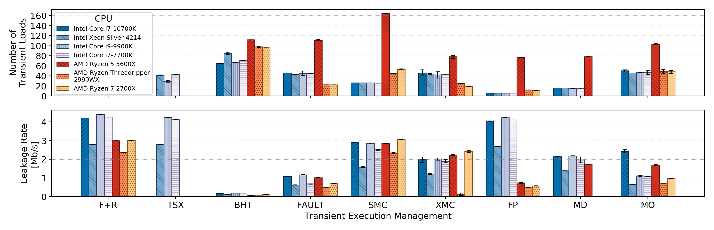

# leak_rate_win_size

This folder contains all the code used to compare the transient window size and leakage rate of the following transient
execution mechanisms:

* TSX
* Branch Misprediction (BHT)
* Exception/Fault (Fault)
* Self-Modifying Code (SMC)
* Cross-Modifying Code (XMC)
* Floating Point Assist (FP)
* Memory Disambiguation Machine Clear (MD)
* Memory Ordering Machine Clear (MO)

For every transient execution mechanism a corresponding asm file is present containing the window size and leak rate
measuring functions. The window size is measured as the number of observed transient loads to a reload buffer.
The leak rate is measured as the bits lekead per second counting the first correct hit as valid.

## Troubleshooting

Use `grep -nri TWEAK` to find all the places where some tweaking may be necessary to make the code working on your
machine
