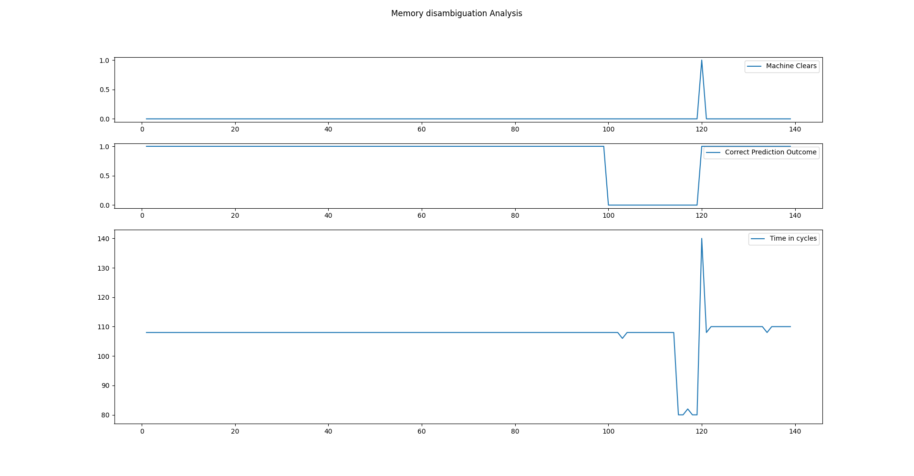
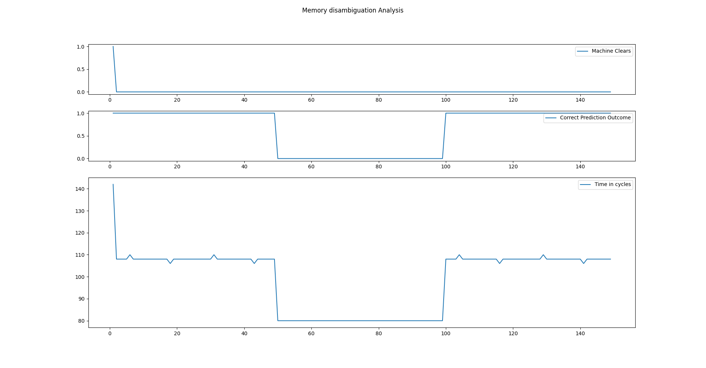
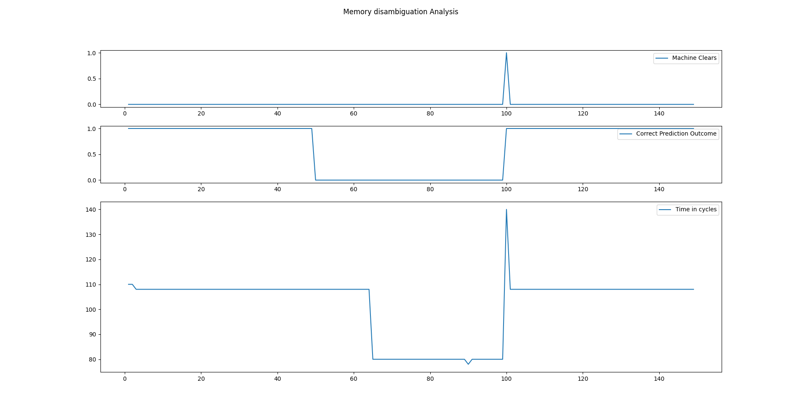
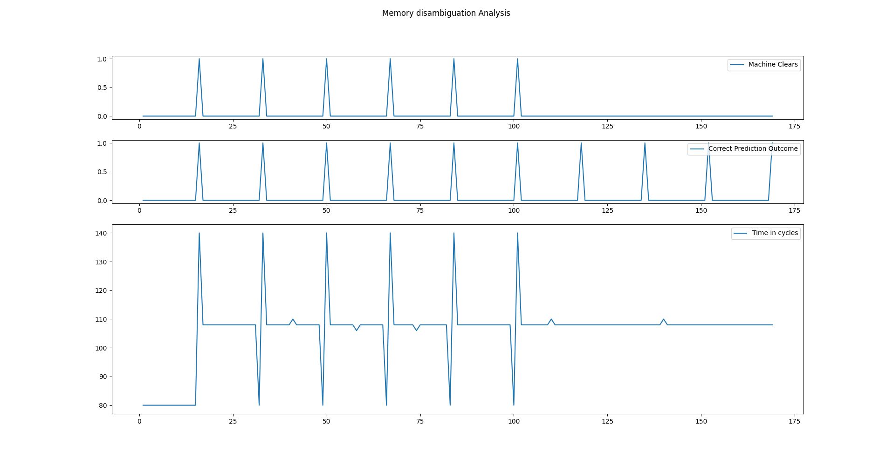
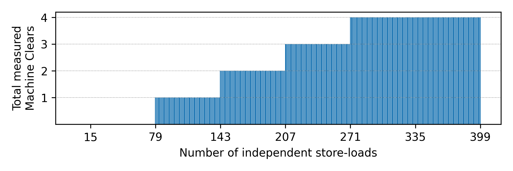
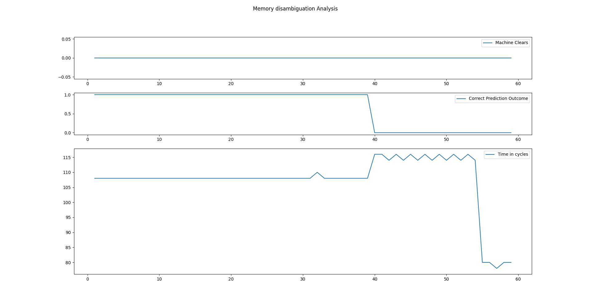

# Memory Disambiguation Unit Reverse Engineering

This folder is a collection of results and experiments on our attempts to reverse engineering the Memory
Disambiguation Unit of Intel processors.

## Related Works/Patents

* [1] https://github.com/travisdowns/uarch-bench/wiki/Memory-Disambiguation-on-Skylake
* [2] https://patents.google.com/patent/US8549263

## How to run experiments

```
sudo ./run.sh exp_XXX.c | python3 tool/plot.py
```

**IMPORTANT:** to reduce the noise of measurements, add the following bootargs:

```
isolcpus=0 vt.handoff=1
```

## Legend

* MDU: memory disambiguation unit
* MC: machine clear


## per_address 

We first perform 100 store-loads on different addresses.
In this way we reset the per-address predictor to 0. 
After this, we schedule 20 store-loads different addresses.
In this way the per-address predictor is switched to "hoisting" prediction.
Finally, we schedule 20 store-loads on the same address causing a MD misprediction, and thus a machine clear.

```
//         N    Store   Load
call_st_ld(100, 0,      0);
call_st_ld(20,  0,      64);
call_st_ld(20,  0,      0);
```



## per_addr_aligned and per_addr_unaligned 

This experiment is inteded to confirm that the per-address predictor of MDU is based on
the lowest bits of the load's opcode address.

For this, we use the help of 2 new functions:
 * `call_pc_unaligned_st_ld`: same as `st_ld` but the store-load location is shifted by 1 thanks to a nop operation before it
 * `call_pc_aligned_st_ld`: same as `st_ld` but the store-load location is aligned wrt lowest bits

In other words:

```
0000000000001000 <st_ld>:
    ...
    1052:       c6 07 42                mov    BYTE PTR [rdi],0x42
    1055:       8a 06                   mov    al,BYTE PTR [rsi]

0000000000002000 <pc_unaligned_st_ld>:
    ...
    2053:       c6 07 42                mov    BYTE PTR [rdi],0x42
    2056:       8a 06                   mov    al,BYTE PTR [rsi]

0000000000003000 <pc_aligned_st_ld>:
    ...
    3052:       c6 07 42                mov    BYTE PTR [rdi],0x42
    3055:       8a 06                   mov    al,BYTE PTR [rsi]
```


The first experiment is the following:

```
//                      N    Store   Load
             call_st_ld(50,  16,     16);
call_pc_unaligned_st_ld(50,  16,     32);
             call_st_ld(50,  16,     16);
```




From the figure, we can observe that the unaligned store-load pair did not affect at all the predictor.
They behave as 2 completely independent predictors.

The second experiment, instead, shows how an aligned store-load pair can affect the local predictor:

```
//                    N    Store   Load
           call_st_ld(50,  16,     16);  
call_pc_aligned_st_ld(50,  16,     32);
           call_st_ld(50,  16,     16);  
```



`st_ld` is always called with store-load on same addresses, so no MC should happen whatsoever.
However, a different store-load pair (on aligned addresses) was able to change the per-address
prediction and thus generate a MC.


## Global watchdog

A simple experiment to show the existance of a watchdog is to trigger as many MD MC as possible in a row:

```
for(int i=0; i<10; i++) {
    //         N   Store  Load
    call_st_ld(16, 0x100, 0x140);
    call_st_ld(1,  0x100, 0x100);   //Trigger misprediction
}
```

As shown from the figure below we can see that after a certain amount of MC the predictor stops to hoist store-loads.
Please notice that this experiment is not accurate due to the extra load/store insturctions added for instrumentation.
See next experiment for more details.



To verify that the global watchdog is a 2 bit counter, the following pseudocode can be used:

```
for(int x=0; x<400; x++) {
    y = 0;
    //Activate watchdog with many MC
    for(int i=0; i<100; i++) {
        for(int j=0; j<15; j++) {
            st_ld(mem, mem+64);
        }
        st_ld(mem, mem);
    }
    //Try to deactivate the watchdog
    for(int i=0; i<x; i++)
        st_ld(mem, mem+64);
    //Observe how many MC we can generate now
    for(int i=0; i<10; i++) {
        for(int j=0; j<15; j++) {
            st_ld(mem, mem+64);
        }
        y += measure_mc(st_ld(mem, mem));   
    }
}
```

By implementing this code entirely in assembly (`watchdog` folder) to do not perform any store or load outside the one under tests, we obtained the following plot:



This shows that the maximum amount of MC MD in a row is 4 and that excatly every 64 *would-be correct hoisting preidiction* the global watchdog counter is incremented.


 

## 4k aliasing

Now that we are sure in which global state the MDU is, let's see how 4k aliasing
behaves when no-hoisting prediction is made.

```
//         N    Store   Load
call_st_ld(20,  0,      0);
call_st_ld(20,  0x1000, 0x1000);
call_st_ld(20,  0,      0x1000);
```


We can observe that the 4k aliasing caused
a time penalty of ~5 clock cycles for the first 4k aliased store-loads.

In addition, this time penalty disapper when the prediction switch to "hoisting".

This can be explained by the fact that the 4k aliasing delays the outcome of the question
"Are the addresses of store and load aliasing?".


